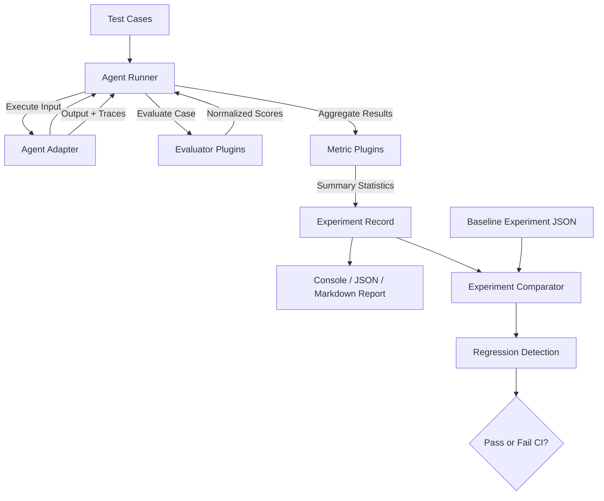

# Agentic Evolution Harness

A modular, framework-agnostic evaluation and benchmarking harness for testing, measuring, comparing, and improving AI agents.

[](https://github.com/CH-JASWANTH-KUMAR/agentic-evolution-harness/actions/workflows/ci.yml)
[](https://github.com/CH-JASWANTH-KUMAR/agentic-evolution-harness/actions/workflows/lint.yml)
[](https://www.python.org/downloads/)
[](LICENSE)
[](https://github.com/astral-sh/ruff)
[](https://mypy-lang.org/)

**Define → Run → Evaluate → Measure → Compare → Improve**

---

## Table of Contents

- [Why This Project?](#why-this-project)
- [What is an Evaluation Harness?](#what-is-an-evaluation-harness)
- [Core Workflow](#core-workflow)
- [Key Features](#key-features)
- [Architecture](#architecture)
- [Supported Evaluators](#supported-evaluators)
- [Supported Metrics](#supported-metrics)
- [Supported Adapters](#supported-adapters)
- [Quick Start](#quick-start)
- [Command Line Interface (CLI)](#command-line-interface-cli)
- [Example Evaluation Output](#example-evaluation-output)
- [Creating a Test Case](#creating-a-test-case)
- [Creating a Custom Evaluator](#creating-a-custom-evaluator)
- [Creating a Custom Agent Adapter](#creating-a-custom-agent-adapter)
- [Adding a Metric](#adding-a-metric)
- [Model Context Protocol (MCP) Extensibility](#model-context-protocol-mcp-extensibility)
- [Agent Evolution & Iterative Improvement](#agent-evolution--iterative-improvement)
- [Comparing Agent Versions](#comparing-agent-versions)
- [Project Structure](#project-structure)
- [Technology Stack](#technology-stack)
- [Testing & Quality Assurance](#testing--quality-assurance)
- [Local Development](#local-development)
- [Contributing](#contributing)
- [Hacktoberfest](#hacktoberfest)
- [Roadmap](#roadmap)
- [Design Principles](#design-principles)
- [Security](#security)
- [License](#license)
- [Acknowledgements](#acknowledgements)
- [Project Status](#project-status)

---

## Why This Project?

Evaluating AI agents is fundamentally harder than testing standard software applications. Unlike deterministic functions, AI agents exhibit:

- **Non-deterministic responses**: The exact same prompt can yield variations in phrasing that break rigid string assertions even when the underlying reasoning is correct.
- **Multi-step execution trajectories**: Modern agents reason, execute tools, retrieve data, and retry. Measuring only the final output obscures unnecessary tool invocations, token inflation, and faulty intermediate steps.
- **Latency and operational cost**: An agent that answers correctly in 15 seconds at \$0.08 per request may be unusable compared to one that succeeds in 1.2 seconds at \$0.003.
- **Fragile reliability**: Minor prompt tweaks, tool schema edits, or model version bumps can introduce unexpected regressions in previously working capabilities.
- **Framework lock-in**: Many existing benchmarking suites tightly couple evaluation logic to specific commercial APIs or heavyweight orchestration frameworks.

Traditional unit testing frameworks (such as `unittest` or raw `pytest`) do not natively provide trajectory accounting, multi-metric directionality, regression threshold enforcement, or cross-run delta tracking.

The **Agentic Evolution Harness** provides a lightweight, modular foundation that abstracts test definitions, execution, assertions, and metrics so you can evaluate any AI agent systematically.

---

## What is an Evaluation Harness?

An **evaluation harness** is an automated test bench designed specifically for evaluating agentic systems.

In classical software engineering, a test harness feeds fixed inputs to a function and asserts on the exact return value. In an AI agent evaluation harness:

1. A **Test Case** specifies user inputs, criteria, and expected behaviors.
2. An **Agent** receives the input and returns a structured output along with observable traces (e.g., tools called, token usage, latency).
3. Pluggable **Evaluators** score individual outputs against task requirements.
4. Pluggable **Metrics** aggregate performance indicators across the full suite.
5. A **Reporter** produces machine-readable artifacts and terminal dashboards.
6. A **Comparator** detects performance improvements or regressions against baseline runs.

```text
Test Case ──► Agent ──► Agent Output / Trace ──► Evaluators ──► Metrics ──► Report
```

---

## Core Workflow



1. **Define**: Author test suites in declarative YAML or JSON format.
2. **Execute**: The runner invokes your agent through an adapter without framework lock-in.
3. **Trace**: Observable execution metadata (tool calls, arguments, latency, errors) is recorded.
4. **Evaluate**: Evaluators score each test case independently with explanations.
5. **Aggregate**: Metrics calculate cross-benchmark statistics (success rate, accuracy, cost, latency).
6. **Compare**: The comparator computes directional performance deltas between versions.
7. **Gate**: Regression rules check whether candidate agent revisions satisfy defined thresholds.

---

## Key Features

- **Framework-Agnostic Core**: Connect any agent—built with LangChain, LangGraph, CrewAI, AutoGen, raw API calls, or custom Python functions.
- **Protocol-Driven Extensibility**: Evaluators, metrics, adapters, and reporters are defined via Python Protocols (`PEP 544`). Add plugins without touching core runner logic.
- **Zero-LLM Default Dependencies**: Built-in evaluators (`exact_match`, `contains`, `json_match`, `tool_usage`) run locally in milliseconds without API keys or network dependencies.
- **Directional Metric Math**: Metrics declare their direction (`higher_is_better`, `lower_is_better`, or `neutral`). The comparison engine automatically identifies whether a metric delta is an improvement or a regression.
- **Regression Detection**: Configure threshold budgets (e.g., minimum 80% success rate, maximum 2.0s latency) to enforce CI quality gates.
- **Rich Terminal UX**: Formatted terminal dashboards with progress tables, status badges, and summary cards powered by Rich.
- **Machine-Readable Artifacts**: Export runs to standardized JSON schema artifacts for archival and CI/CD pipelines.
- **Strict Typing & Quality**: 100% type-annotated with MyPy strict mode, linted with Ruff, and tested with pytest.

---

## Architecture

The codebase enforces strict separation of concerns across decoupled packages:

```text
src/harness/
├── core/         # Protocols (Agent, Evaluator, Metric) & Data Models
├── runner/       # AgentRunner pipeline orchestrator & execution timer
├── evaluators/   # Single-test evaluation plugins (exact_match, contains, json_match, tool_usage)
├── metrics/      # Cross-test aggregation plugins (success_rate, accuracy, latency, cost, reliability)
├── adapters/     # Agent integration bridges (generic, mock, subprocess)
├── reporters/    # Output formatters (console, json, markdown)
├── benchmarks/   # YAML/JSON benchmark schema & loader
├── comparison/   # ExperimentComparator & RegressionDetector
└── cli/          # Typer CLI commands (evaluate, compare, validate, list-plugins)
```

### Component Responsibilities

- **Core (`harness.core`)**: Defines immutable data models (`TestCase`, `AgentOutput`, `EvaluationResult`, `TestCaseResult`, `Experiment`, `Trace`) and runtime protocols. Has zero external dependencies outside Pydantic.
- **Runner (`harness.runner`)**: Dispatches inputs to the agent, records execution durations, resolves evaluators dynamically, and packages results. Contains zero evaluator-specific logic.
- **Evaluators (`harness.evaluators`)**: Independent plugins evaluating a single `(TestCase, AgentOutput)` pair.
- **Metrics (`harness.metrics`)**: Plugins computing aggregate statistics over a collection of `TestCaseResult` records.
- **Adapters (`harness.adapters`)**: Adapters standardizing external agent invocations into the `Agent` protocol.
- **Reporters (`harness.reporters`)**: Translators formatting experiment models into Rich console output, JSON artifacts, or Markdown tables.
- **Comparison (`harness.comparison`)**: Compares baseline and candidate experiment runs, computes metric deltas, and validates regression thresholds.

---

## Supported Evaluators

All built-in evaluators are deterministic and run locally without API keys:

| Evaluator | Identifier | Purpose | Key Options |
| :--- | :--- | :--- | :--- |
| **Exact Match** | `exact_match` | Verifies identical string equality between output and expected text. | `ignore_case` (bool), `strip_whitespace` (bool) |
| **Contains** | `contains` | Asserts substring inclusion or regular expression pattern matching. | `substring` (str), `is_regex` (bool), `case_sensitive` (bool) |
| **JSON Match** | `json_match` | Verifies structural and semantic JSON equivalence. Tolerates code blocks. | `subset` (bool), `ignore_order` (bool) |
| **Tool Usage** | `tool_usage` | Validates tool call trajectories, required sequences, and arguments. | `expected_tools` (list), `ordered` (bool), `forbidden_tools` (list), `validate_args` (dict) |

---

## Supported Metrics

Metrics aggregate performance across all executed test cases:

| Metric | Identifier | Direction | Purpose |
| :--- | :--- | :--- | :--- |
| **Success Rate** | `success_rate` | `higher_is_better` | Percentage of test cases that passed all assigned evaluators. |
| **Accuracy** | `accuracy` | `higher_is_better` | Mean normalized evaluation score (0.0 to 1.0) across all tests. |
| **Average Latency** | `latency` | `lower_is_better` | Mean execution duration in seconds per test case. |
| **Total Cost** | `cost` | `lower_is_better` | Summed monetary cost in USD across all executions. |
| **Reliability** | `reliability` | `higher_is_better` | Percentage of agent runs that completed without errors or crashes. |

---

## Supported Adapters

Adapters connect external agents to the standard `Agent` protocol:

| Adapter | Identifier | Purpose | Configuration |
| :--- | :--- | :--- | :--- |
| **Generic** | `generic` | Dynamically imports and executes any Python function or class callable. | `module`: `"pkg.module:callable"` |
| **Mock** | `mock` | Returns deterministic canned responses and simulated tool calls. | `responses` (dict), `latency` (float), `default_output` (str) |
| **Subprocess** | `subprocess` | Executes an external CLI tool or binary via standard input/output. | `command` (list/str), `timeout_seconds` (float) |

---

## Quick Start

You can clone, install, and execute your first agent evaluation benchmark in under 3 minutes.

### 1. Clone & Install

```bash
git clone https://github.com/CH-JASWANTH-KUMAR/agentic-evolution-harness.git
cd agentic-evolution-harness

# Install dependencies using uv
uv sync

# Or using pip in a virtual environment:
# python -m venv .venv && source .venv/bin/activate && pip install -e ".[dev]"
```

### 2. Run Test Suite

Verify that your local environment is correctly configured:

```bash
uv run pytest
```

### 3. Run a Benchmark Evaluation

Evaluate the included customer support mock agent against a test benchmark:

```bash
uv run harness evaluate examples/basic/benchmark.yaml
```

### 4. Compare Agent Iterations

Compare a baseline run against an improved agent version to inspect performance deltas:

```bash
uv run harness compare examples/basic/v1_baseline.json examples/basic/v2_improved.json
```

---

## Command Line Interface (CLI)

The CLI provides four core commands:

### `harness evaluate`
Executes an evaluation benchmark against an agent:
```bash
uv run harness evaluate <path/to/benchmark.yaml> [OPTIONS]

# Common Options:
#   --agent, -a TEXT        Override agent callable (e.g. "my_module:run_agent")
#   --output, -o PATH       Output artifact path (default: results/latest.json)
#   --format, -f TEXT       Report format: console, json, or markdown
#   --thresholds / --no-thresholds   Enforce regression thresholds (default: on)
```

### `harness compare`
Compares two experiment JSON runs and displays metric deltas:
```bash
uv run harness compare <baseline.json> <candidate.json> [OPTIONS]

# Common Options:
#   --fail-on-regression / --allow-regression   Exit code 1 if metrics regress
```

### `harness validate`
Validates a benchmark configuration syntax and schema without executing the agent:
```bash
uv run harness validate examples/basic/benchmark.yaml
```

### `harness list-plugins`
Lists all discovered and registered evaluators, metrics, adapters, and reporters:
```bash
uv run harness list-plugins
```

---

## Example Evaluation Output

When running `uv run harness evaluate examples/basic/benchmark.yaml`:

```text
╭─────────────────────────────────────────────────────────╮
│ Agentic Evolution Harness                               │
│ Experiment ID: c14aae1f | Name: basic-support-benchmark │
╰─────────────────────────────────────────────────────────╯
                             Test Results (5 cases)                             
╭──────────┬─────────────────┬───────┬──────────┬──────────────────────────────╮
│  Status  │ Test Case       │ Score │ Duration │ Explanation                  │
├──────────┼─────────────────┼───────┼──────────┼──────────────────────────────┤
│  ✓ PASS  │ refund_request  │  1.00 │    0.00s │ Output contains 'Refund of   │
│          │                 │       │          │ $49.99 processed'.           │
│  ✓ PASS  │ order_status    │  1.00 │    0.00s │ Output contains 'in          │
│          │                 │       │          │ transit'.                    │
│  ✓ PASS  │ weather_lookup  │  1.00 │    0.00s │ Output contains '65°F and    │
│          │                 │       │          │ sunny'.                      │
│  ✓ PASS  │ greeting        │  1.00 │    0.00s │ Output matches expected      │
│          │                 │       │          │ output exactly.              │
│  ✗ FAIL  │ unknown_request │  0.00 │    0.00s │ Expected 'Rocket launched    │
│          │                 │       │          │ successfully.', but received │
│          │                 │       │          │ 'I'm sorry, I didn't         │
│          │                 │       │          │ understand your request.'.   │
╰──────────┴─────────────────┴───────┴──────────┴──────────────────────────────╯
                                Summary Metrics                                 
╭──────────────┬─────────┬────────────────────┬────────────────────────────────╮
│ Metric       │ Value   │ Direction          │ Description                    │
├──────────────┼─────────┼────────────────────┼────────────────────────────────┤
│ Success Rate │ 80.0%   │ ▲ higher is better │ Percentage of passed test      │
│              │         │                    │ cases                          │
│ Accuracy     │ 0.80    │ ▲ higher is better │ Average normalized score       │
│              │         │                    │ across all test cases          │
│ Latency      │ 0.19s   │ ▼ lower is better  │ Average execution latency in   │
│              │         │                    │ seconds                        │
│ Cost         │ $0.0007 │ ▼ lower is better  │ Total monetary cost in USD     │
│ Reliability  │ 100.0%  │ ▲ higher is better │ Percentage of error-free       │
│              │         │                    │ executions                     │
╰──────────────┴─────────┴────────────────────┴────────────────────────────────╯
Full report written to: results/latest.json
```

---

## Creating a Test Case

Test cases are defined in YAML or JSON files conforming to `BenchmarkConfig`:

```yaml
version: "1.0"
name: "customer-support-benchmark"
description: "Evaluates order lookup and refund capabilities."

agent:
  adapter: generic
  module: "examples.basic.mock_agent:support_agent"

evaluators:
  - name: contains

metrics:
  - success_rate
  - accuracy
  - latency

thresholds:
  success_rate:
    minimum: 0.80

tests:
  - id: "refund-01"
    name: "refund_request"
    description: "Verify refund processing and tool trajectory."
    input: "My item was broken. Please process a refund."
    expected: "Refund of $49.99 processed"
    evaluators:
      - name: contains
        options:
          substring: "Refund of $49.99 processed"
      - name: tool_usage
        options:
          expected_tools: ["lookup_order", "process_refund"]
          ordered: true
    tags: ["billing", "refunds"]
```

### Field Definitions

- `id`: Unique identifier for the test case.
- `name`: Human-readable name used in reports and diffs.
- `input`: Prompt string or dictionary provided to the agent.
- `expected`: Ground truth text, structured dictionary, or expected tool list.
- `evaluators`: List of evaluator configurations specific to this test case.
- `tags`: Optional list of category labels for filtering and reporting.

---

## Creating a Custom Evaluator

Contributors can add new evaluators without modifying the core runner or existing components.

1. **Create a new file** in `src/harness/evaluators/fuzzy.py`:

```python
from __future__ import annotations

from harness.core.agent import AgentOutput
from harness.core.result import EvaluationResult
from harness.core.testcase import TestCase
from harness.evaluators.base import EvaluatorRegistry


@EvaluatorRegistry.register("fuzzy")
class FuzzyMatchEvaluator:
    """Evaluates whether output text matches expected text above a threshold."""

    name: str = "fuzzy"

    def __init__(self, threshold: float = 0.8) -> None:
        self.threshold = threshold

    def evaluate(self, test_case: TestCase, output: AgentOutput) -> EvaluationResult:
        if output.is_error:
            return EvaluationResult(
                evaluator=self.name,
                score=0.0,
                passed=False,
                explanation=f"Agent produced an error: {output.error}",
            )

        expected = str(test_case.expected or "")
        actual = output.text

        # Compute simple character overlap ratio
        overlap = len(set(actual) & set(expected)) / max(len(set(expected)), 1)
        passed = overlap >= self.threshold

        return EvaluationResult(
            evaluator=self.name,
            score=overlap,
            passed=passed,
            explanation=f"Overlap ratio was {overlap:.2f} (threshold: {self.threshold:.2f}).",
        )
```

2. **Expose the evaluator** in `src/harness/evaluators/__init__.py`:

```python
from harness.evaluators.fuzzy import FuzzyMatchEvaluator

__all__ = [
    ...,
    "FuzzyMatchEvaluator",
]
```

3. **Add unit tests** in `tests/unit/evaluators/test_fuzzy.py`.

4. **Verify**:
```bash
uv run harness list-plugins evaluators
uv run pytest tests/unit/evaluators/test_fuzzy.py
```

---

## Creating a Custom Agent Adapter

To evaluate an agent built with LangChain, CrewAI, AutoGen, or an internal framework, wrap it in a lightweight callable or create an adapter:

```python
from harness.core.agent import AgentOutput
from harness.core.trace import ToolCallRecord

def my_custom_agent(user_input: str) -> AgentOutput:
    # 1. Call your model or agent framework
    response = call_llm(user_input)
    
    # 2. Return standard AgentOutput
    return AgentOutput(
        output=response.text,
        latency=response.latency_seconds,
        tool_calls=[
            ToolCallRecord(tool_name=t.name, args=t.args) 
            for t in response.tool_calls
        ],
    )
```

Specify your agent in your benchmark YAML:

```yaml
agent:
  adapter: generic
  module: "my_project.agent:my_custom_agent"
```

---

## Adding a Metric

Metrics aggregate results across multiple test cases.

1. **Create the file** in `src/harness/metrics/p95_latency.py`:

```python
from __future__ import annotations

from collections.abc import Sequence
from harness.core.experiment import MetricResult
from harness.core.result import TestCaseResult
from harness.metrics.base import MetricDirection, MetricRegistry


@MetricRegistry.register("p95_latency")
class P95LatencyMetric:
    """Computes 95th percentile execution latency across test cases."""

    name: str = "p95_latency"
    direction: MetricDirection = MetricDirection.LOWER_IS_BETTER

    def calculate(self, results: Sequence[TestCaseResult]) -> MetricResult:
        if not results:
            return MetricResult(
                name=self.name,
                value=0.0,
                formatted_value="0.00s",
                direction=self.direction.value,
                description="95th percentile latency",
            )

        latencies = sorted(r.duration for r in results)
        idx = int(0.95 * len(latencies))
        p95 = latencies[min(idx, len(latencies) - 1)]

        return MetricResult(
            name=self.name,
            value=p95,
            formatted_value=f"{p95:.2f}s",
            direction=self.direction.value,
            description="95th percentile execution latency in seconds",
        )
```

2. Register the metric in `src/harness/metrics/__init__.py` and add unit tests in `tests/unit/metrics/test_p95_latency.py`.

---

## Model Context Protocol (MCP) Extensibility

The harness is designed to support the Model Context Protocol (MCP) ecosystem without making MCP mandatory for the core framework.

### Currently Implemented
- **Structured Tool Traces**: `ToolCallRecord` captures tool names, input arguments, outputs, execution duration, and statuses.
- **Trajectory Validation**: `ToolUsageEvaluator` validates:
  - Inclusion of expected tool calls.
  - Strict sequence ordering of tool calls.
  - Prohibition of forbidden tools.
  - Exact argument matching.

### Planned Extension Points
- **MCP Client Adapter**: Direct invocation of MCP servers to capture server-side tool calls and protocol traffic.
- **MCP Trajectory Evaluator**: Verification of multi-server tool selection, intermediate tool error recovery, and context resource retrieval.

---

## Agent Evolution & Iterative Improvement

In this framework, **"Evolution"** does not mean autonomous, self-modifying code. Rather, it refers to the **evidence-based iterative improvement cycle** used by engineers to improve agent performance:

```text
Agent v1 ──► Evaluation ──► Baseline Results
                                  │
      ┌───────────────────────────┘
      ▼
Refactor Agent Prompt / Tools
      │
      ▼
Agent v2 ──► Evaluation ──► Candidate Results
                                  │
                                  ▼
                            Compare Runs
                                  │
                                  ├──► Verified Improvements
                                  └──► Regression Detection
```

---

## Comparing Agent Versions

The comparison engine computes directional deltas between two runs:

```bash
uv run harness compare results/v1_baseline.json results/v2_improved.json
```

```text
                               Metric Comparison                                
╭──────────────┬───────────────┬───────────────┬───────────────┬───────────────╮
│ Metric       │ Baseline (v1) │ Candidate(v2) │         Delta │  Evaluation   │
├──────────────┼───────────────┼───────────────┼───────────────┼───────────────┤
│ Accuracy     │          0.80 │          1.00 │       +0.2000 │ ▲ Improvement │
│              │               │               │      (+25.0%) │               │
│ Cost         │       $0.0007 │       $0.0006 │       -0.0001 │ ▲ Improvement │
│              │               │               │      (-13.0%) │               │
│ Latency      │         0.19s │         0.13s │       -0.0620 │ ▲ Improvement │
│              │               │               │      (-32.3%) │               │
│ Reliability  │        100.0% │        100.0% │        0.0000 │   • Neutral   │
│ Success Rate │         80.0% │        100.0% │       +0.2000 │ ▲ Improvement │
│              │               │               │      (+25.0%) │               │
╰──────────────┴───────────────┴───────────────┴───────────────┴───────────────╯
Newly passing tests (1): unknown_request
```

If a candidate violates a regression threshold (e.g., latency rises above allowable limits or success rate drops), the CLI exits with status code `1` to stop deployment in CI.

---

## Project Structure

```text
.
├── benchmarks/
│   └── examples/           # Standard benchmark datasets (YAML)
├── docs/
│   ├── architecture.md     # Detailed architecture specification
│   ├── quickstart.md       # Quickstart walkthrough
│   └── concepts/           # Deep-dive concept guides
├── examples/
│   └── basic/              # Runnable examples, mock agent, and baseline runs
├── src/
│   └── harness/            # Core package
│       ├── adapters/       # Generic, Mock, Subprocess adapters
│       ├── benchmarks/     # Benchmark schemas and loader
│       ├── cli/            # Typer CLI commands
│       ├── comparison/     # Comparator and regression detection
│       ├── core/           # Protocols and domain models
│       ├── evaluators/     # Built-in evaluators
│       ├── metrics/        # Built-in metrics
│       ├── reporters/      # Console, JSON, Markdown reporters
│       └── runner/         # Execution orchestrator
├── tests/
│   ├── integration/        # Pipeline and CLI integration tests
│   └── unit/               # Unit tests per component
├── CHANGELOG.md            # Version history
├── CODE_OF_CONDUCT.md      # Contributor Covenant v2.1
├── CONTRIBUTING.md         # Contributor guidelines and workflow
├── LICENSE                 # MIT License
├── Makefile                # Automation commands
├── pyproject.toml          # Project configuration and dependencies
└── SECURITY.md             # Security vulnerability reporting policy
```

---

## Technology Stack

- **Python**: 3.11+
- **Pydantic (v2)**: Data validation, schema definitions, and serialization.
- **Typer**: Type-safe CLI commands with argument and option parsing.
- **Rich**: Terminal tables, panels, badges, and progress rendering.
- **PyYAML**: Benchmark configuration parsing.
- **pytest & pytest-cov**: Unit and integration testing with branch coverage.
- **Ruff**: Fast Python formatting and linting.
- **MyPy**: Strict static type checking.

---

## Testing & Quality Assurance

The codebase enforces strict quality checks:

```bash
# Run complete test suite with coverage
uv run pytest

# Check formatting and linting
uv run ruff check .
uv run ruff format --check .

# Run static type checker
uv run mypy src
```

You can run all quality checks with a single command:

```bash
make check
```

---

## Local Development

Setting up the development environment:

```bash
# Sync all dependencies including dev tools
uv sync --all-extras

# Run tests
uv run pytest

# Auto-format and fix linter issues
make format
```

---

## Contributing

We welcome community contributions! Please review our [Contributing Guide](CONTRIBUTING.md) for full instructions.

### Where Should I Contribute?

| Goal | Target Directory | Tests Directory |
| :--- | :--- | :--- |
| **Add an Evaluator** | `src/harness/evaluators/` | `tests/unit/evaluators/` |
| **Add a Metric** | `src/harness/metrics/` | `tests/unit/metrics/` |
| **Add an Agent Adapter** | `src/harness/adapters/` | `tests/unit/adapters/` |
| **Add a Reporter** | `src/harness/reporters/` | `tests/unit/reporters/` |
| **Add Benchmark Data** | `benchmarks/examples/` | `tests/integration/` |
| **Improve CLI** | `src/harness/cli/` | `tests/integration/test_cli.py` |
| **Documentation** | `docs/` or `README.md` | *None* |

---

## Hacktoberfest

This repository is designed specifically for Hacktoberfest contributors:
- **Modular Isolation**: Evaluators, metrics, and adapters can be implemented in a single isolated file without altering the runner.
- **Fast Local Feedback**: The entire test suite runs in under 1 second locally without external API keys.
- **Clear Contracts**: Protocols clearly define method signatures, input types, and return values.

Check out our [Contributing Guide](CONTRIBUTING.md) for beginner, intermediate, and advanced starter ideas.

---

## Roadmap

### Current (v0.1.0)
- [x] Protocol-driven `Agent`, `Evaluator`, `Metric`, and `Reporter` architecture.
- [x] Built-in evaluators: `exact_match`, `contains`, `json_match`, `tool_usage`.
- [x] Built-in metrics: `success_rate`, `accuracy`, `latency`, `cost`, `reliability`.
- [x] Built-in adapters: `generic`, `mock`, `subprocess`.
- [x] Built-in reporters: `console`, `json`, `markdown`.
- [x] Experiment persistence, cross-run comparison, and regression threshold detection.
- [x] Typer CLI (`evaluate`, `compare`, `validate`, `list-plugins`).
- [x] 90% branch test coverage, MyPy strict typing, Ruff linting, and GitHub Actions CI.

### Next / Planned
- [ ] **Parallel Test Runner**: Concurrent test case execution via worker thread pools.
- [ ] **LLM-as-a-Judge**: Abstract judge extension with provider agnostic connectors.
- [ ] **Interactive HTML Reporter**: Standalone interactive HTML report with charts.
- [ ] **Native MCP Client**: Live Model Context Protocol client adapter for inspecting tool invocations.
- [ ] **Statistical Significance**: Bootstrapping and t-tests for comparing benchmark iterations.

---

## Design Principles

1. **Modularity**: Every evaluator and metric is an independent, pluggable component.
2. **Framework Agnosticism**: The harness treats any agent as a callable black box.
3. **Reproducibility**: Evaluations produce deterministic, versioned JSON records.
4. **Minimal Dependencies**: The core framework avoids heavy dependencies or vendor lock-in.
5. **Developer Experience**: Clear protocols, automated linting, type safety, and helpful CLI diagnostics.

---

## Security

Please refer to our [Security Policy](SECURITY.md) for information on reporting security vulnerabilities.

---

## License

This project is licensed under the [MIT License](LICENSE).

---

## Acknowledgements

Built for AI agent researchers, software engineers, and the open-source community participating in Hacktoberfest.

---

## Project Status

**Active Development** (v0.1.0). The core evaluation pipeline, CLI, built-in evaluators, metrics, reporters, and comparison engine are fully implemented, tested, and ready for use.
